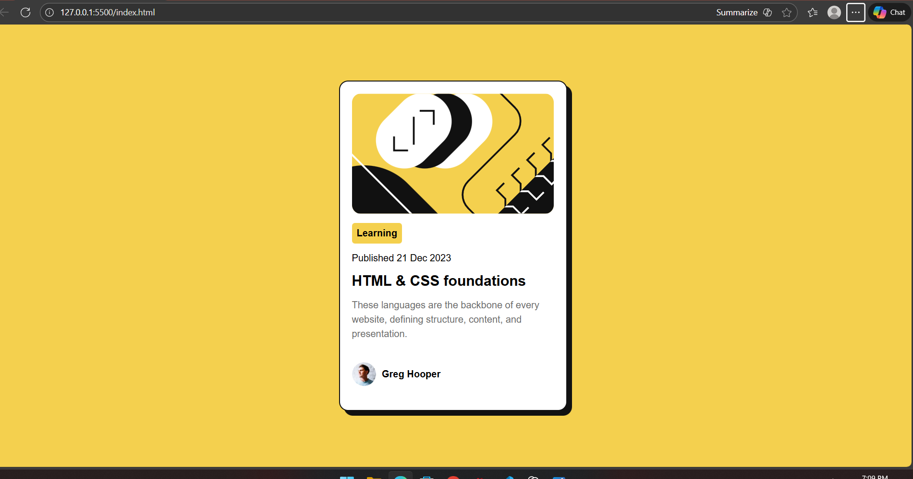

📄 Frontend Mentor – Blog Preview Card Solution

This is my solution to the Blog Preview Card challenge on Frontend Mentor.
The goal of this challenge was to build a responsive and visually accurate blog card component using HTML & CSS.

🚀 Overview
📌 The Challenge

Users should be able to:

See hover states for the card title

View a responsive card that adapts to mobile & desktop

See a clean and accurate UI based on the design files

📷 Screenshot

Add your screenshot here:

 

🔗 Links

Solution URL: https://github.com/Mano6383/blog-preview-card.git

Live Site URL: Add your Netlify/Vercel link here

🛠 My Process
💻 Built With

Semantic HTML5

CSS (Flexbox)

CSS Custom Properties

Mobile-first workflow

Simple card layout

Box-shadow & border styling

✨ What I Learned

This small project helped me strengthen:

How to create a clean, centered layout

Using box-shadow to create a sharp offset shadow

Working with border radius on images

Improving spacing & visual hierarchy

Understanding how small UI adjustments make a big difference

Example of the shadow I used:

box-shadow: 8px 8px 0 hsl(0, 0%, 7%);

🔮 Continued Development

Going forward, I want to focus more on:

Responsive layout improvements

Pixel-perfect alignment

Better understanding of typographic sizing

Building more component-based layouts

📚 Useful Resources

MDN Box Shadow

Frontend Mentor Slack Community
 – great for feedback

👤 Author

Frontend Mentor – @Mano6383

GitHub – https://github.com/Mano6383